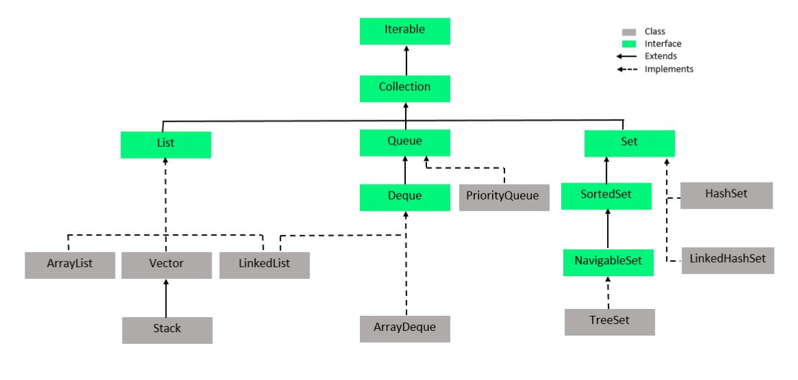

1. **Interfaces:**
   - **Collection:** The root interface in the collections hierarchy. It represents a group of objects known as elements.
   - **List:** An ordered collection that allows duplicate elements. It provides positional access to elements.
   - **Set:** A collection that does not allow duplicate elements. It does not maintain any order.
   - **Map:** An object that maps keys to values. Each key must be unique, and each key can only have one value associated with it.
   - **Queue:** A collection used to hold elements prior to processing. Queues typically order elements in a FIFO (First-In-First-Out) manner.

2. **Classes:**
   - **ArrayList:** Implements the List interface using a dynamically resizable array.
   - **LinkedList:** Implements the List interface using a doubly-linked list. Provides efficient insertion and deletion operations.
   - **HashSet:** Implements the Set interface using a hash table. Does not maintain any order.
   - **TreeSet:** Implements the Set interface using a sorted tree structure (Red-Black tree). Elements are ordered based on their natural ordering or a custom Comparator.
   - **HashMap:** Implements the Map interface using a hash table. Provides constant-time performance for basic operations (put and get).
   - **TreeMap:** Implements the Map interface using a Red-Black tree. Provides log(n) time cost for most operations.
   - **PriorityQueue:** Implements the Queue interface using a priority heap. Elements are ordered based on their natural ordering or a custom Comparator.

3. **Utilities:**
   - **Collections:** Provides various utility methods for operating on collections, such as sorting, searching, shuffling, etc.
   - **Arrays:** Provides utility methods for manipulating arrays, such as sorting, searching, and filling.

4. **Concurrency Utilities:**
   - **ConcurrentHashMap:** A high-performance concurrent map implementation.
   - **ConcurrentLinkedQueue:** A scalable, thread-safe queue implementation.
   - **CopyOnWriteArrayList:** A thread-safe variant of ArrayList in which all mutative operations (add, set, remove) are implemented by making a fresh copy of the underlying array.

### when to use?

1. **List vs. Set vs. Map:**
   - **List:** Use when you need an ordered collection that allows duplicate elements and provides positional access (e.g., ArrayList, LinkedList).
   - **Set:** Use when you need a collection that does not allow duplicate elements and does not maintain any order (e.g., HashSet, TreeSet).
   - **Map:** Use when you need to map keys to values and ensure each key is unique (e.g., HashMap, TreeMap).

2. **ArrayList vs. LinkedList:**
   - **ArrayList:** Use when you need fast random access and iteration but can tolerate slower insertion and removal (e.g., when frequent access by index is required).
   - **LinkedList:** Use when you need fast insertion and removal but can tolerate slower access and iteration (e.g., when frequent insertion/deletion at both ends of the list is required).

3. **HashSet vs. TreeSet:**
   - **HashSet:** Use when you need a fast, unordered set that does not allow duplicate elements and does not require sorting.
   - **TreeSet:** Use when you need a sorted set or want to maintain the elements in a specific order (natural order or custom order specified by a Comparator).

4. **HashMap vs. TreeMap:**
   - **HashMap:** Use when you need fast key-value lookups and do not require sorting or maintaining the elements in a specific order.
   - **TreeMap:** Use when you need a sorted map or want to maintain the keys in a specific order (natural order or custom order specified by a Comparator).

5. **LinkedHashMap vs. LinkedHashMap:**
   - **LinkedHashSet:** Use when you need to maintain the insertion order of elements in a set.
   - **LinkedHashMap:** Use when you need to maintain the insertion order of key-value pairs in a map.

6. **Queue vs. Deque:**
   - **Queue:** Use when you need to model a first-in-first-out (FIFO) data structure (e.g., LinkedList or PriorityQueue).
   - **Deque (Double-ended Queue):** Use when you need to model a data structure that supports insertion and removal at both ends (e.g., ArrayDeque).

7. **ConcurrentHashMap vs. Hashtable:**
   - **ConcurrentHashMap:** Use when you need a thread-safe map with better concurrency performance than Hashtable, especially in scenarios with high contention.
   - **Hashtable:** Use when you need a thread-safe map but can tolerate lower concurrency performance or when targeting legacy systems.
